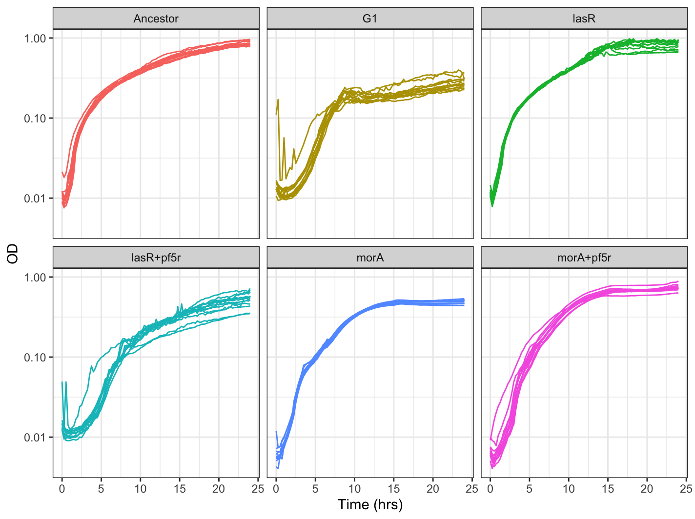
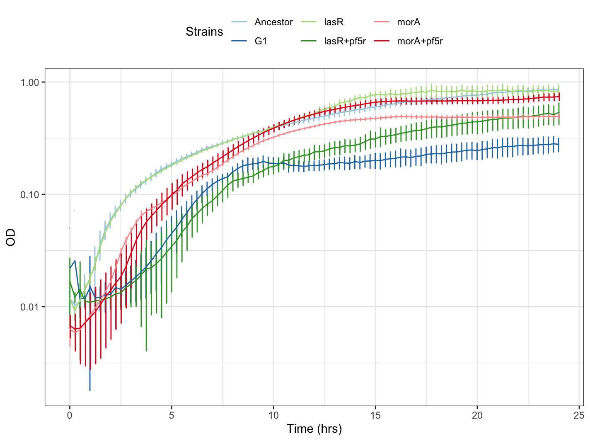
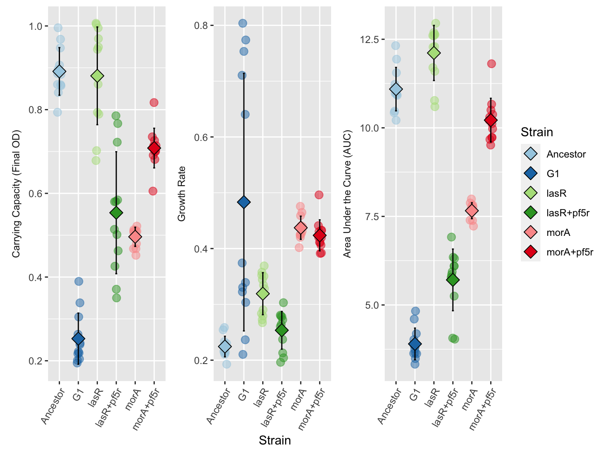

<br>

This tutorial is for converting your plate reader data into growth curves in R. Since the Cooper lab has two different plate readers with difference version of the software, be sure to check which plate reader software was used before proceeding. I have divided the tutorial based on the old vs newer program. 

<b>Note: If doing growth curves on the Tecan, skip to the section on [data manipulation from Tecan](#tecan)</b>

The plate reader with the newer program is located by the centrifuge next to the chemical hood while the plate reader with the older program is located by the entrance.

<br>

# Load libraries and data files

## Newer program

Make sure to have a csv file of your plate reader output. You can do this by first downloading the data as an Excel (.xls) file, then clicking "Save as" to change it into a csv file. [Click here](../sample_data/new_plate_reader_data.csv) to download the example csv file if you would like to follow along. Check your file path of your csv file, as this will be different from mine:

```r
file <- "/Users/kubotan/Downloads/new_plate_reader_data.csv" #filepath of your csv file
p <- read.csv(file,header=T,skip=2) #read the csv as a dataframe and skip the first row
```

Check to make sure your dataframe looks like this when using the head() function:
```R
head(p) #view first few rows of dataframe
```
```
##      Time Temperature..C.     A1     A2     A3     A4     A5     A6     A7
## 1 0:00:00            24.1 0.0834 0.0869 0.0869 0.0867 0.0871 0.0878 0.0874
## 2 0:15:00            36.2 0.0832 0.0866 0.0868 0.0867 0.0871 0.0878 0.0872
## 3 0:30:00            37.0 0.0846 0.0865 0.0937 0.0863 0.0872 0.0876 0.0871
## 4 0:45:00            37.0 0.0848 0.0868 0.0853 0.0865 0.0877 0.0886 0.0869
## 5 1:00:00            37.0 0.0852 0.0866 0.0868 0.0868 0.0879 0.0893 0.0871
## 6 1:15:00            37.0 0.0851 0.0868 0.0868 0.0866 0.0879 0.0884 0.0873
##       A8     A9    A10    A11    A12     B1     B2     B3     B4     B5     B6
## 1 0.0875 0.0865 0.0869 0.0874 0.0862 0.0960 0.0990 0.0980 0.0980 0.0986 0.0991
## 2 0.0876 0.0862 0.0865 0.0872 0.0861 0.0944 0.0989 0.0962 0.0963 0.0970 0.0974
## 3 0.0874 0.0861 0.0864 0.0873 0.0860 0.0981 0.0997 0.0975 0.0974 0.0986 0.0981
## 4 0.0875 0.0863 0.0867 0.0873 0.0861 0.1060 0.1021 0.0979 0.0994 0.1041 0.1000
## 5 0.0875 0.0862 0.0866 0.0870 0.0862 0.1093 0.1058 0.1024 0.1023 0.1081 0.1022
## 6 0.0878 0.0865 0.0865 0.0874 0.0864 0.1125 0.1162 0.1070 0.1097 0.1176 0.1072
##       B7     B8     B9    B10    B11    B12     C1     C2     C3     C4     C5
## 1 0.0992 0.1083 0.0980 0.0971 0.0987 0.0957 0.0996 0.0988 0.0980 0.1015 0.0975
## 2 0.0969 0.1050 0.0966 0.0953 0.0968 0.0947 0.0968 0.0960 0.0954 0.0979 0.0949
## 3 0.0976 0.1076 0.0973 0.0959 0.0971 0.0952 0.1023 0.0987 0.0981 0.1011 0.0977
## 4 0.0994 0.1147 0.0995 0.0974 0.0994 0.0964 0.1053 0.1013 0.0991 0.1038 0.1003
## 5 0.1015 0.1280 0.1024 0.0999 0.1016 0.0990 0.1103 0.1049 0.1042 0.1083 0.1037
## 6 0.1079 0.1396 0.1096 0.1032 0.1051 0.1015 0.1182 0.1117 0.1110 0.1184 0.1102
##       C6     C7     C8     C9    C10    C11    C12     D1     D2     D3     D4
## 1 0.0990 0.0981 0.0983 0.0976 0.0988 0.0997 0.0984 0.0912 0.0936 0.0927 0.0927
## 2 0.0962 0.0956 0.0953 0.0947 0.0958 0.0967 0.0962 0.0909 0.0934 0.0926 0.0924
## 3 0.0991 0.0981 0.0980 0.0970 0.0988 0.0988 0.0983 0.0931 0.0938 0.0930 0.0928
## 4 0.1017 0.1007 0.1003 0.0994 0.1011 0.1014 0.1008 0.0943 0.0948 0.0923 0.0935
## 5 0.1054 0.1042 0.1036 0.1026 0.1048 0.1041 0.1033 0.0953 0.0955 0.0950 0.0945
## 6 0.1112 0.1106 0.1099 0.1089 0.1102 0.1097 0.1076 0.0966 0.0970 0.0964 0.0962
##       D5     D6     D7     D8     D9    D10    D11    D12     E1     E2     E3
## 1 0.0926 0.0924 0.0920 0.0926 0.0932 0.0931 0.0941 0.0989 0.0992 0.1021 0.1013
## 2 0.0922 0.0922 0.0921 0.0922 0.0928 0.0933 0.0943 0.0942 0.0963 0.0997 0.0996
## 3 0.0926 0.0933 0.0930 0.0929 0.0932 0.0938 0.0948 0.0949 0.0971 0.0987 0.0987
## 4 0.0937 0.0936 0.0942 0.0938 0.0939 0.0948 0.0959 0.0961 0.0972 0.0985 0.0968
## 5 0.0950 0.0945 0.0955 0.0949 0.0949 0.0958 0.0969 0.0973 0.0972 0.0982 0.0977
## 6 0.0964 0.0959 0.0970 0.0964 0.0966 0.0971 0.0988 0.0988 0.0972 0.0987 0.0982
##       E4     E5     E6     E7     E8     E9    E10    E11    E12     F1     F2
## 1 0.1032 0.0991 0.0996 0.1002 0.1016 0.0996 0.1013 0.1363 0.1015 0.0920 0.0936
## 2 0.1003 0.0999 0.0972 0.0975 0.0993 0.0982 0.0999 0.0996 0.1003 0.0909 0.0924
## 3 0.0995 0.1361 0.0963 0.0969 0.0985 0.0976 0.0994 0.0991 0.0998 0.0926 0.0923
## 4 0.0988 0.1012 0.0960 0.0968 0.0980 0.0974 0.0989 0.0987 0.0992 0.0933 0.0926
## 5 0.0988 0.0995 0.0962 0.0968 0.0982 0.0971 0.0992 0.0987 0.0992 0.0942 0.0932
## 6 0.0993 0.1002 0.0964 0.0970 0.0984 0.0975 0.0991 0.0992 0.0997 0.0950 0.0941
##       F3     F4     F5     F6     F7     F8     F9    F10    F11    F12     G1
## 1 0.0970 0.0945 0.0927 0.0915 0.0961 0.0929 0.0933 0.0942 0.0937 0.0933 0.0976
## 2 0.0959 0.0938 0.0923 0.0913 0.0992 0.0917 0.0919 0.0930 0.0928 0.0926 0.0962
## 3 0.0959 0.0939 0.0919 0.0915 0.1036 0.0918 0.0922 0.0931 0.0926 0.0923 0.0967
## 4 0.0948 0.0940 0.0926 0.0916 0.1072 0.0922 0.0922 0.0936 0.0930 0.0924 0.0968
## 5 0.0975 0.0947 0.0927 0.0920 0.1112 0.0927 0.0928 0.0945 0.0937 0.0927 0.0968
## 6 0.0990 0.0956 0.0933 0.0925 0.1142 0.0935 0.0935 0.0956 0.0945 0.0933 0.0967
##       G2     G3     G4     G5     G6     G7     G8     G9    G10    G11    G12
## 1 0.1000 0.1026 0.1026 0.0999 0.1975 0.1019 0.1036 0.1000 0.0999 0.1001 0.1005
## 2 0.0979 0.1003 0.1015 0.0980 0.2577 0.1013 0.1016 0.0990 0.0985 0.0985 0.0997
## 3 0.0972 0.0990 0.1010 0.0977 0.1038 0.1003 0.1005 0.0978 0.0978 0.0973 0.0983
## 4 0.0972 0.0976 0.1002 0.0973 0.1038 0.0996 0.0999 0.0999 0.0981 0.0975 0.0976
## 5 0.0970 0.0990 0.1004 0.0973 0.1439 0.0995 0.1000 0.0982 0.0979 0.0975 0.0980
## 6 0.0972 0.0992 0.1009 0.0975 0.1046 0.0995 0.1002 0.0979 0.0980 0.0976 0.1004
##       H1     H2     H3     H4     H5     H6     H7     H8     H9    H10    H11
## 1 0.0845 0.0866 0.0868 0.0900 0.0870 0.0872 0.0874 0.0873 0.0885 0.0873 0.0868
## 2 0.0842 0.0863 0.0868 0.0902 0.0869 0.0874 0.0879 0.0872 0.0884 0.0872 0.0867
## 3 0.0856 0.0861 0.0870 0.0900 0.0868 0.0876 0.0877 0.0872 0.0885 0.0872 0.0868
## 4 0.0857 0.0864 0.0855 0.0898 0.0868 0.0876 0.0878 0.0874 0.0887 0.0874 0.0871
## 5 0.0860 0.0864 0.0871 0.0895 0.0868 0.0876 0.0878 0.0873 0.0887 0.0875 0.0869
## 6 0.0856 0.0865 0.0871 0.0900 0.0868 0.0877 0.0878 0.0874 0.0886 0.0875 0.0870
##      H12
## 1 0.0862
## 2 0.0860
## 3 0.0861
## 4 0.0863
## 5 0.0865
## 6 0.0864
```

Now, if you inspect the dataframe, there are a few rows and column that we don't need (such as the last few rows and the temperature column, respectively).
```R
tail(p) #view last few rows of dataframe
```
```
##                                                                                     Time
## 95                                                                              23:30:00
## 96                                                                              23:45:00
## 97                                                                            1.00:00:00
## 98                                                                                      
## 99                                                                                  ~End
## 100 Original Filename: 2021-08-18 G1 growth curve; Date Last Saved: 8/20/2021 4:15:24 PM
##     Temperature..C.     A1     A2     A3     A4     A5     A6     A7     A8
## 95               37 0.0855 0.0866 0.0872 0.1047 0.0880 0.0892 0.0886 0.0872
## 96               37 0.0852 0.0871 0.0874 0.0872 0.0882 0.0891 0.0871 0.0870
## 97               37 0.0856 0.0869 0.0968 0.0867 0.0884 0.0891 0.0870 0.0873
## 98               NA     NA     NA     NA     NA     NA     NA     NA     NA
## 99               NA     NA     NA     NA     NA     NA     NA     NA     NA
## 100              NA     NA     NA     NA     NA     NA     NA     NA     NA
##         A9    A10    A11    A12     B1     B2     B3     B4     B5     B6
## 95  0.0867 0.0868 0.0876 0.0862 0.8622 0.9900 0.9351 0.9237 0.9251 0.8757
## 96  0.0862 0.0869 0.0873 0.0863 0.8981 0.9959 0.9488 0.9353 0.9298 0.8826
## 97  0.0905 0.0869 0.0871 0.0861 0.8745 0.9972 0.9350 0.9203 0.9350 0.8842
## 98      NA     NA     NA     NA     NA     NA     NA     NA     NA     NA
## 99      NA     NA     NA     NA     NA     NA     NA     NA     NA     NA
## 100     NA     NA     NA     NA     NA     NA     NA     NA     NA     NA
##         B7     B8     B9    B10    B11    B12     C1     C2     C3     C4
## 95  0.8937 0.9997 0.9294 1.0335 0.9385 0.9022 0.7500 0.8158 0.9156 0.8685
## 96  0.9010 1.0152 0.9479 1.0459 0.9515 0.9047 0.7482 0.7974 0.8985 0.8542
## 97  0.9049 1.0208 0.9461 1.0432 0.9538 0.9145 0.7470 0.7983 0.9096 0.8711
## 98      NA     NA     NA     NA     NA     NA     NA     NA     NA     NA
## 99      NA     NA     NA     NA     NA     NA     NA     NA     NA     NA
## 100     NA     NA     NA     NA     NA     NA     NA     NA     NA     NA
##         C5     C6     C7     C8     C9    C10    C11    C12     D1     D2
## 95  0.9890 0.9619 1.0404 1.0468 1.0068 1.0282 0.9749 0.7781 0.6198 0.6001
## 96  0.9496 0.9254 0.9802 0.9823 0.9804 0.9846 0.9549 0.7635 0.6223 0.6006
## 97  0.9682 0.9745 1.0399 1.0467 1.0125 1.0332 0.9952 0.7713 0.6244 0.6001
## 98      NA     NA     NA     NA     NA     NA     NA     NA     NA     NA
## 99      NA     NA     NA     NA     NA     NA     NA     NA     NA     NA
## 100     NA     NA     NA     NA     NA     NA     NA     NA     NA     NA
##         D3     D4     D5     D6     D7     D8     D9    D10    D11    D12
## 95  0.6016 0.5969 0.5928 0.5540 0.5627 0.5594 0.5302 0.5856 0.5943 0.5927
## 96  0.6077 0.5963 0.5933 0.5545 0.5631 0.5570 0.5304 0.5859 0.5933 0.5932
## 97  0.6159 0.5970 0.5943 0.5567 0.5636 0.5578 0.5305 0.5878 0.5947 0.5934
## 98      NA     NA     NA     NA     NA     NA     NA     NA     NA     NA
## 99      NA     NA     NA     NA     NA     NA     NA     NA     NA     NA
## 100     NA     NA     NA     NA     NA     NA     NA     NA     NA     NA
##         E1     E2     E3     E4     E5     E6     E7     E8     E9    E10
## 95  0.4411 0.4356 0.5548 0.5163 0.6492 0.7288 0.6303 0.5958 0.6586 0.6583
## 96  0.4397 0.4349 0.5495 0.5175 0.5991 0.7538 0.6150 0.5893 0.6476 0.6444
## 97  0.4416 0.4389 0.5493 0.5239 0.6650 0.8083 0.6322 0.6033 0.6656 0.6583
## 98      NA     NA     NA     NA     NA     NA     NA     NA     NA     NA
## 99      NA     NA     NA     NA     NA     NA     NA     NA     NA     NA
## 100     NA     NA     NA     NA     NA     NA     NA     NA     NA     NA
##        E11    E12     F1     F2     F3     F4     F5     F6     F7     F8
## 95  0.7231 0.7687 0.8092 0.8199 0.8863 0.8426 0.8036 0.7772 0.7154 0.8184
## 96  0.7042 0.7272 0.8061 0.8189 0.8926 0.8328 0.8042 0.7778 0.7192 0.8176
## 97  0.7373 0.7726 0.8024 0.8319 0.8872 0.8387 0.8100 0.7816 0.7214 0.8277
## 98      NA     NA     NA     NA     NA     NA     NA     NA     NA     NA
## 99      NA     NA     NA     NA     NA     NA     NA     NA     NA     NA
## 100     NA     NA     NA     NA     NA     NA     NA     NA     NA     NA
##         F9    F10    F11    F12     G1     G2     G3     G4     G5     G6
## 95  0.8104 0.9478 0.7935 0.8518 0.4752 0.3847 0.3265 0.3343 0.3439 0.3224
## 96  0.8110 0.9510 0.7982 0.8613 0.4512 0.3918 0.3336 0.3484 0.3500 0.3203
## 97  0.8166 0.9790 0.8169 0.8600 0.4572 0.3933 0.3336 0.3479 0.3533 0.3266
## 98      NA     NA     NA     NA     NA     NA     NA     NA     NA     NA
## 99      NA     NA     NA     NA     NA     NA     NA     NA     NA     NA
## 100     NA     NA     NA     NA     NA     NA     NA     NA     NA     NA
##         G7     G8     G9    G10    G11    G12     H1     H2     H3     H4
## 95  0.3738 0.3525 0.3948 0.4085 0.3699 0.3077 0.0890 0.0866 0.0874 0.0890
## 96  0.3896 0.3465 0.3916 0.4529 0.3582 0.3145 0.0881 0.0869 0.0875 0.0891
## 97  0.3757 0.3477 0.3997 0.3942 0.3614 0.3147 0.0868 0.0867 0.0874 0.0889
## 98      NA     NA     NA     NA     NA     NA     NA     NA     NA     NA
## 99      NA     NA     NA     NA     NA     NA     NA     NA     NA     NA
## 100     NA     NA     NA     NA     NA     NA     NA     NA     NA     NA
##         H5     H6     H7     H8     H9    H10    H11    H12
## 95  0.0870 0.0880 0.0881 0.0883 0.0890 0.0883 0.0875 0.0868
## 96  0.0878 0.0878 0.0879 0.0877 0.0889 0.0882 0.0874 0.1111
## 97  0.0981 0.0880 0.0879 0.0879 0.0889 0.0884 0.0874 0.0871
## 98      NA     NA     NA     NA     NA     NA     NA     NA
## 99      NA     NA     NA     NA     NA     NA     NA     NA
## 100     NA     NA     NA     NA     NA     NA     NA     NA
```

We will remove the unnecessary rows and columns:

```r
p <- head(p,-3) #remove last few rows
p <- p[,-2] #remove temperature column
```

We will also relabel the 24 hour time point into hh:mm:ss format:
```R
p[97,which(colnames(p)%in%"Time")]  <- c("24:00:00") #run for newer program
```


## Older program

Export your data as a .txt file from the older program. [Click here](../sample_data/old_plate_reader_data.txt) to download the example txt file if you would like to follow along. Make sure to check your file path before reading the data file using the read.delim() function:

```r
file <- "/Users/kubotan/Downloads/old_plate_reader_data.txt"
p <- read.delim(file,header=F,skip = 2)
```

We will need to clean the dataframe:
```r
p <- read.delim(file,header=F,skip = 2)
pcol <- as.character(unlist(p[1,-c(2,99)])) #extract column name except column 2 and 99
p <- p[-c(1,99),-c(2,99)] #for 24 hr; may need adjustment for 48 hr growth curves
colnames(p) <- pcol
rownames(p) <- 1:97 #for 24 hr; use 1:193 for 48 hr
p[,2:97] <- sapply(p[,2:97],as.numeric) 
names(p)[names(p) == "Time(hh:mm:ss)"] <- "Time" #rename Time column
p[1:4,which(colnames(p)%in%"Time")]  <- c("0:00:00","0:15:00","0:30:00","0:45:00")
```

## Tecan

The Tecan outputs an Excel file in plate format (rather than column format) so you will need to convert this first before proceeding. 

I wrote a python script to do this, and you can [download it from my Github](https://github.com/NanamiKubota/NanamiKubota.github.io/blob/main/scripts/tecan_plate2column_v2.py). Just click the download button on the top right so start your download.

You can run the script either on Beagle (i.e. Cooper Lab server) or locally on your computer. If you are doing the latter, make sure that you have the following python libraries as they are required to run the script:

- os
- pandas
- numpy
- argparse

On Beagle, you may need to load miniconda-3 before running the script:
```
module load miniconda/miniconda-3
```

Then run the script by (make sure your filepath correctly points to the script and your input file):
```
python3 tecan_plate2column_v2.py -i your_tecan_file.xlsx
```

Optionally, you can designate the output file name by using the -o or --output parameter.

For more info, run:
```
python3 tecan_plate2column_v2.py --help
```

Then make sure to remove the temperature (Temp) and cycle number (Cycle) column in R before moving onto the next section.

```r
file <- "/Users/kubotan/Downloads/tecan_plate2column.csv" #filepath of your csv file
p <- read.csv(file,header=T) #read the csv as a dataframe
p <- p[, !(names(df) %in% c("Temp", "Cycle"))]
```

## 96-well plate key

Make sure you make your own spreadsheet that tells you which well in your 96-well plate contained which samples. The general format of your spreadsheet should look like this, where the first column is your well and your second column is your sample name:

<table>
  <tr>
    <td class="tg-c3ow">A1</td>
    <td class="tg-c3ow">Strain1<br></td>
  </tr>
  <tr>
    <td class="tg-c3ow">A2</td>
    <td class="tg-c3ow">Strain1</td>
  </tr>
  <tr>
    <td class="tg-c3ow">A3</td>
    <td class="tg-c3ow">Strain1</td>
  </tr>
  <tr>
    <td class="tg-c3ow">A4</td>
    <td class="tg-c3ow">Strain2</td>
  </tr>
  <tr>
    <td class="tg-c3ow">A5</td>
    <td class="tg-c3ow">Strain2</td>
  </tr>
  <tr>
    <td class="tg-c3ow">A6</td>
    <td class="tg-c3ow">Strain2</td>
  </tr>
  <tr>
    <td class="tg-c3ow">A7</td>
    <td class="tg-c3ow">Strain3</td>
  </tr>
  <tr>
    <td class="tg-c3ow">A8</td>
    <td class="tg-c3ow">Strain3</td>
  </tr>
  <tr>
    <td class="tg-c3ow">A9</td>
    <td class="tg-c3ow">Strain3</td>
  </tr>
  <tr>
    <td class="tg-c3ow">A10</td>
    <td class="tg-c3ow">blank</td>
  </tr>
  <tr>
    <td class="tg-c3ow">A11</td>
    <td class="tg-c3ow">blank</td>
  </tr>
  <tr>
    <td class="tg-c3ow">A12</td>
    <td class="tg-c3ow">blank</td>
  </tr>
  <tr>
    <td class="tg-c3ow">B1</td>
    <td class="tg-c3ow">Strain1</td>
  </tr>
  <tr>
    <td class="tg-c3ow">B2</td>
    <td class="tg-c3ow">Strain1</td>
  </tr>
  <tr>
    <td class="tg-c3ow">B3</td>
    <td class="tg-c3ow">Strain1</td>
  </tr>
  <tr>
    <td class="tg-c3ow">.<br>.<br>.</td>
    <td class="tg-c3ow">.<br>.<br>.</td>
  </tr>
  <tr>
    <td class="tg-c3ow">H12</td>
    <td class="tg-c3ow">blank</td>
  </tr>
</table>

You do not need a header, and you should denote your blank wells (i.e. your control wells that you will normalize to) as "blank" with a lowercase *b*. You should have 2 columns and a total of 96 rows in your spreadsheet that starts from A1 and ends with H12. Save this spreadsheet as a csv file. An example of this key spreadsheet can found by clicking [here](../sample_data/plate_reader_key.csv) (a download prompt will begin).

Read the key into R:
```R
k <- "/Users/kubotan/Downloads/plate_reader_key.csv"
key <- read.csv(k,header=F) #key to denote what samples are in each well
```

<br>

***

<br>

# Graph the growth curves

<br>

You will need the following libraries to graph the growth curves.

```r
library(ggplot2)
library(reshape2)
library(RColorBrewer)
```

Then we will rename the columns with the sample name by using a for loop:
```R
for (i in 2:ncol(p)) {
  well <- colnames(p)[i]
  num <- which(key[,1]%in%well)
  colnames(p)[i] <- as.character(key[num,2])
}
```

Then we will take the readings from the blank wells and average them:
```R
blank <- p[,which(colnames(p)%in%"blank")]
indx <- sapply(blank, is.factor)
blank[indx] <- lapply(blank[indx], function(x) as.numeric(as.character(x)))
blank_mean <- data.frame(Time=p[,1],Means=rowMeans(blank,na.rm=TRUE))
pdata <- p[,-which(colnames(p)%in%"blank")]
pdata$blank_mean <- blank_mean[,2] #name new column blank_mean with average of all blanks
```

Then we will take the average of the blank wells and normalize the rest of the wells by subtracting the average from the rest of the wells:
```R
pcal <- pdata
for (i in 2:ncol(pdata)) {
  pcal[,i] <- as.numeric(as.character(pdata[,i]))-as.numeric(as.character(pdata$blank_mean))
}
pclean <- pcal[,-which(colnames(pcal)%in%"blank_mean")]
pclean$Time <- p[,1]
```
Finally, we will convert the Time column into decimals, so that it can be plotted across the x-axis:
```r
pclean$Time <- as.factor(pclean$Time)
pclean$Time_convert <- unlist(lapply(lapply(strsplit(as.character(pclean$Time), ":"), as.numeric), function(x) x[1]+x[2]/60))
pclean2 <- pclean[,!names(pclean) %in% c("Time")]
pclean2 <- pclean2[,!names(pclean2) %in% c("Time(hh:mm:ss)")] #only for older program?
pmelt <- melt(pclean2,id.vars="Time_convert") #melt dataframe
pmelt$strain <- gsub("\\..*","",pmelt$variable) #remove numbers from strain names
```

Then we can plot our growth curves using ggplot:
```R
ggplot(pmelt,aes(x=Time_convert, y=value, group=variable, color=strain))+
  theme_bw() +
  geom_line()+
  scale_y_continuous(trans = 'log10')+ #use for log scale
  xlab("Time (hrs)") + ylab("OD")+
  xlim(0,24)+
  facet_wrap(~strain)+ #facet_wrap(~strain,ncol=2)
  theme(legend.position="none")
```

Your graph should look something like this:

{: .image-resize .image-center}

If you would like an average of all your data points and just show errorbars, first create a function that calculates the average and standard deviation of the OD readings:
```R
data_summary <- function(data, varname, groupnames){
  require(plyr)
  summary_func <- function(x, col){
    c(mean = mean(x[[col]], na.rm=TRUE),
      sd = sd(x[[col]], na.rm=TRUE))
  }
  data_sum<-ddply(data, groupnames, .fun=summary_func,
                  varname)
  data_sum <- plyr::rename(data_sum, c("mean" = varname))
  return(data_sum)
}
```

Then run this function on your dataframe:
```R
df <- data_summary(pmelt,varname = "value",groupnames = c("strain","Time_convert"))
```

Finally, lets use the R Color Brewer package to color our plot by strain and graph it using ggplot:
```R
gc_avg2 <- ggplot(df, aes(x=Time_convert, y=value, group=strain, color=strain)) + 
  geom_errorbar(aes(ymin=value-sd, ymax=value+sd), width=.1,position=position_dodge(0.05)) +
  geom_line() +
  scale_color_manual(values=col)+ #values=cols[2:1]
  scale_y_continuous(trans = 'log10')+ #use for log scale
  labs(color = "Strains", x="Time (hrs)", y="OD")+
  theme_bw()+
  theme(legend.position = "top")
```

Your plot should look something like this:
{: .image-resize .image-center}

<br>

***

<br>

# Statistical analysis

<br>

## Calculating stats (Growthcurver)

To perform quantitative comparisons between your strains, we will calculate the growth rate, the area under the curve (AUC), and the final OD (carrying capacity) of each strain. For this we will use the [Growthcurver](https://cran.r-project.org/web/packages/growthcurver/vignettes/Growthcurver-vignette.html) package in R.

```R
library(growthcurver)
```

We will go back to our *pdata* dataframe and make a new dataframe called *gc_p*:
```R
gc_p <- pdata
```

This is so that we can have an identical copy to work with just in case we need to go back to *pdata*. We also want to use *pdata* instead of our other dataframes that we cleaned because we want the raw OD values and not the values that already have the mean of the blank wells subtracted from.

Next, rename the *blank_mean* column to *blank*. This is done because the Growthcurver package knows to look for a column name "blank" to use as the blank. If we had a different column name, it wouldn't know where to look.
```R
names(gc_p)[names(gc_p) == 'blank_mean'] <- 'blank'
```

Convert your time column into decimals:
```R
#loop to convert >24h format
gc_p$Time <- as.factor(gc_p$Time)
gc_p$Time <- unlist(lapply(lapply(strsplit(as.character(gc_p$Time), ":"), as.numeric), function(x) x[1]+x[2]/60))
```

We are now ready to run calculations. Do this using the following line of code:
```R
gc_out <- SummarizeGrowthByPlate(gc_p,bg_correct = "blank")
```

Finally, lets clean up some of the strain names and remove the blank row (i.e. the last row):
```R
gc_out$sample <- gsub("\\..*","",gc_out$sample)
gc_out <- head(gc_out, -1) #remove last row (i.e. blank)
```

Lets save this output of the calculation as a text file:
```R
output_file_name <- "/Users/kubotan/Downloads/growth curve calc.txt" #your output file location
write.table(gc_out, file = output_file_name, quote = FALSE, sep = "\t", row.names = FALSE)
```

If you ever need to load your calculations into R, you can do this by:
```R
gc_out <- read.table(output_file_name,header=T,sep="\t")
```
Where *output_file_name* is where you saved your file. Your output file, if you used the practice data set, should look like [this]() (a download prompt will begin).

> Note: Growthcurver calculates more than just the area under the curve (AUC), growth rate, and final OD (carrying capacity). To understand what each abbreviation means and to better understand what each measures, please read the [Growthcurver documentation](https://cran.r-project.org/web/packages/growthcurver/vignettes/Growthcurver-vignette.html).

A general gist of what each column denotes is:
- k = carrying capacity
- n0 = initial population size
- r = growth rate
- t_mid = time at which the population density reaches 1/2 of carrying capacity (k)
- t_gen = fastest possible generation (doubling time)
- auc_l = area under the logistic curve
- auc_e = empirical area under the curve which is obtained by summing up the area under the experimental curve from the measurements in the input data.

## Plotting stats (ggplot)

We are interested in the area under the curve (AUC), growth rate, and the final OD (carrying capacity). We will extract columns with only these stats from the *gc_out* dataframe using the tidyverse package.
```R
library(tidyverse)
gc_out2 <- gc_out %>% 
  select(sample,k,r,auc_e) #strain names, carrying capacity, growth rate, and area under the curve
```

We will also rename the sample column to "Strain":
```R
names(gc_out2)[names(gc_out2) == 'sample'] <- 'Strain'
```

Then convert the dataframe into long format in order to be able to plot in ggplot:
```R
gc_long <- melt(gc_out2, id = "Strain") 
```

Then pick colors from Color Brewer:
```r
col <- brewer.pal(8, "Paired")
```

Finally, plot your stats using ggplot:
```R
ggplot(gc_long, aes(x = Strain, y = value,fill=Strain,color=Strain)) +
  geom_point(size=3, alpha=0.5, position=position_jitter(w=0.1, h=0))+
  facet_wrap(~variable, scales = "free",strip.position = "left",
             labeller = as_labeller(c(k="Carrying Capacity (Final OD)", r="Growth Rate", auc_e="Area Under the Curve (AUC)")))+
  scale_fill_manual(values=col[1:8])+
  scale_color_manual(values=col[1:8])+
  stat_summary(fun.min=function(y)(mean(y)-sd(y)), 
               fun.max=function(y)(mean(y)+sd(y)),
               geom="errorbar", width=0.1, color="black") +
  stat_summary(fun=base::mean, geom="point", shape=23, color="black",size=4)+
  theme(axis.title.y = element_blank(),
        axis.text.x = element_text(angle = 60, vjust = 1, hjust=1),
        strip.background = element_blank(),
        strip.placement = "outside")
```

Your plot should look something like this:
{: .image-resize .image-center}