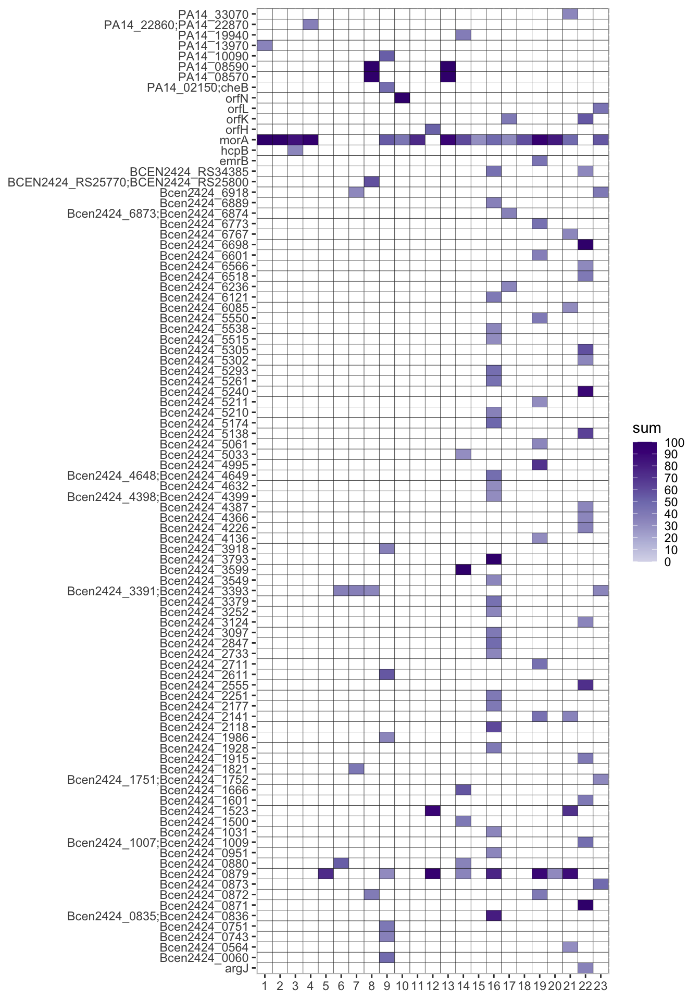

<br>

This tutorial will go over how to make heatmaps from breseq output files. Make sure you have successfully ran breseq before proceeding. I've written [a tutorial on how to run breseq here](../tutorials/breseq).

# Clean and prepare data

Read your breseq csv file into R:
```r
df_snp7 <- read.csv("burk_pa_bre_out.snp.old_locus.csv",header=TRUE,row.names = 1) #read snp csv file
head(df_snp7)
```
```
##      Sample        annotation                            description evidence
## 1 breseq_01 S207S (AGT->AGC)  hemolysin activation/secretion protein       RA
## 2 breseq_01 R208R (CGG->CGA)  hemolysin activation/secretion protein       RA
## 3 breseq_01 K132E (AAG->GAG)                             lipoprotein       RA
## 4 breseq_01  P49P (CCT->CCG)                    hypothetical protein       RA
## 5 breseq_01  N35S (AAC->AGC)                    hypothetical protein       RA
## 6 breseq_01  D34A (GAC->GCC)                    hypothetical protein       RA
##   freq..          gene mutation position
## 1    100 PA14_00490 ->     T->C  7744893
## 2    100 PA14_00490 ->     G->A  7744896
## 3    100 PA14_00740 <-     T->C  7775580
## 4    100 PA14_00970 <-     A->C  7799447
## 5    100 PA14_00970 <-     T->C  7799490
## 6    100 PA14_00970 <-     T->G  7799493
```

We will also read the day 16 csv file since the first breseq run is our ancestor, and we will need the ancestor for both day 7 and 16 analysis.
```r
df_snp16 <- read.csv("burk_pa_bre_out_16.snp.old_locus.csv",header=TRUE,row.names = 1) #read snp csv file
```


Download the [sample_key.xlsx](https://docs.google.com/spreadsheets/d/17VLDoXvHrVZAxibjhq1iS-AkmhYNR_ap/edit?usp=sharing&ouid=114092716123764107382&rtpof=true&sd=true) and save it as a csv file.

Open it in R and subset only the day 7 data:
```r
key <- read.csv("sample_key.csv")
key$key <- gsub("[0-9]+$", "",key$key) #remove numbers at the end from key column
key$key <- gsub("-","",key$key) #remove dash (-) at the end from key column
key7 <- subset(key,day==7) #subset day 7 key
```

Subset only day 16 too:
```r
key16 <- subset(key,day==16) #subset day 16 key
```


To know which breseq number is which treatment group (PA, BC, 50:50, etc.), we will merge the day 7 snp dataframe with the day 7 sample key dataframe:
```r
names(df_snp7)[names(df_snp7) == "Sample"] <- "sample" #rename df_snp Sample column to sample in order to match key dataframe sample column name
df_snp_key7 <- merge(df_snp7, key7, by="sample") #merge dataframes by "sample" column
head(df_snp_key7)
```

Do the same with day 16:
```r
names(df_snp16)[names(df_snp16) == "Sample"] <- "sample" #rename df_snp Sample column to sample in order to match key dataframe sample column name
df_snp_key16 <- merge(df_snp16, key16, by="sample") #merge dataframes by "sample" column
head(df_snp_key16)
```


To make it easier to do comparisons between different breseq runs, we will get rid of symbols signs in the gene column.
```r
gene_symbol7 <- gsub("[^[:alnum:][:blank:]\\_]", "", df_snp_key7$gene) #remove all symbols except underscore (_)
gene_space7 <- gsub("   ", ";", gene_symbol7) #replace three spaces with semicolon (;)
gene_clean7 <- gsub(" ", "", gene_space7) #remove space
head(gene_clean7)
```

Again, do the same for day 16:
```r
gene_symbol16 <- gsub("[^[:alnum:][:blank:]\\_]", "", df_snp_key16$gene) #remove all symbols except underscore (_)
gene_space16 <- gsub("   ", ";", gene_symbol16) #replace three spaces with semicolon (;)
gene_clean16 <- gsub(" ", "", gene_space16) #remove space
head(gene_clean16)
```


Put the cleaned gene column back into the dataframe:
```r
df_snp_key7$gene_clean <- gene_clean7 #day 7
df_snp_key16$gene_clean <- gene_clean16 #day 16
```


We will subset our first breseq run from **day 16 ** (i.e. day 16 breseq_01, the ancestor) and make a new dataframe out of it called df_snp_ref:
```r
df_snp_ref <- subset(df_snp_key16,sample == "breseq_01")
head(df_snp_ref)
```

Then, you can use *%in%* to look for genes that are present in df_snp (all breseq runs) and also in df_snp_ref (ancestor; day 16 breseq_01). Lets call this new dataframe df_snp_refmatch7: 
```r
df_snp_refmatch7 <- df_snp_key7[(df_snp_key7$gene_clean %in% df_snp_ref$gene_clean),]
head(df_snp_refmatch7)
```

But because we are interested in looking for genes in df_snp (all breseq runs) that are NOT found in df_snp_ref (ancestor; day 16 breseq_01), we will use the exclamation point (!) to indicate this and save it in a dataframe called df_snp_noref7:
```r
df_snp_noref7 <- df_snp_key7[!(df_snp_key7$gene_clean %in% df_snp_ref$gene_clean),]
head(df_snp_noref7)
```

Then in a new column called *mutant*, we will save the gene name + annotation. The gene name and annotation will be separated by an underscore (_):
```r
df_snp_noref7$mutant <- paste(df_snp_noref7$gene_clean, df_snp_noref7$annotation,sep="_")
head(df_snp_noref7)
```

Save your df_snp_no_ref7 (i.e. day 7 snps not in ancestor) as a csv file:
```r
write.csv(df_snp_noref7,file="df_snp_noref_d7.csv") #use this output!
```

Install and load the *reshape2* package:
```{r message=FALSE}
library(reshape2)
```

Clean the data so we can sum the frequency of each mutation for each breseq run:
```r
snp_d7_sum <- aggregate(freq.. ~ sample+gene_clean+key, df_snp_noref7, sum)
```

We will rename our column names so that it is easier to understand:
```r
colnames(snp_d7_sum) <- c("sample","gene_clean","key","sum")
```

Lets also clean up the sample names by removing "breseq_" and the 0 in front of single digit numbers:
```r
snp_d7_sum$sample <- as.factor(gsub("breseq_","",snp_d7_sum$sample))
snp_d7_sum$sample <- gsub("^0+","",snp_d7_sum$sample)
```

Then we will subset the dataframe so that we only have samples that have a sum of 30 or higher. This number is arbitrary and was picked because that is what Chris Marshall picked for day 7:
```r
snp_d7_sum$sample <- factor(snp_d7_sum$sample,levels = as.character(1:23)) #reorder sample from smallest number to largest number
snp_d7_sum30 <- subset(snp_d7_sum,sum>=30) #subset rows with sum >=30
```

Notice how we only have 127 rows for our snp_d7_sum30 dataframe:
```r
nrow(snp_d7_sum30)
```

Whereas our snp_d7_sum (our original dataframe) has 1927 rows:
```r
nrow(snp_d7_sum)
```


If we plot snp_d7_sum30 as is, then we will get cells in our heatmap that are missing values:
```{r, echo=FALSE, fig.height=10}
library("RColorBrewer")
col <- brewer.pal(9, "Purples")

heatmap_missing <- ggplot(snp_d7_sum30, aes(x=sample, y=gene_clean,fill=sum))+
  geom_tile(color = "black",lwd = 0.1,linetype = 1) +
  scale_fill_gradientn(colours=col[3:9], na.value = "white",breaks = c(0,(1:9)*10,100), labels = c(0,(1:9)*10,100),limits=c(0,100),oob=scales::squish)+
  theme(axis.title.x = element_blank(),axis.title.y = element_blank())
heatmap_missing
```


This is because only 127 breseq run + gene combination had frequency values above 30.

However, we still want to keep genes that may have NAs (no value) for certain breseq runs but have values in other breseq runs (i.e. the values present in snp_d7_sum30). Otherwise, we will be missing values (and color) in our heatmap cells where there are NAs. To avoid this, do:
```r
snp_d7_sum30_clean <- complete(snp_d7_sum30, sample, gene_clean)
```

<br>

### Plot heatmap

Chris Marshall uses the *superheat* package for his heatmaps, but I prefer ggplots since it is easier to customize so we will make our heatmaps using ggplots.

Make sure you load *ggplot2* and *RColorBrewer* if you haven't done so and do the following:
```r
library("RColorBrewer")
col <- brewer.pal(9, "Purples") #gives you color codes for a purple gradient

heatmap <- ggplot(snp_d7_sum30_clean, aes(x=sample, y=gene_clean,fill=sum))+
  geom_tile(color = "black",lwd = 0.1,linetype = 1) +
  scale_fill_gradientn(colours=col[3:9], na.value = "white",breaks = c(0,(1:9)*10,100), labels = c(0,(1:9)*10,100),limits=c(0,100),oob=scales::squish)+
  theme(axis.title.x = element_blank(),axis.title.y = element_blank())
heatmap
```


Save your heatmap:
```r
ggsave("burk_pa_heatmap_d7.png", plot = heatmap, device = "png",width = unit(10,"cm"), height = unit(8,"cm"))
```


Now, do the same with the new junction and missing coverage csv for day 7 and all csv for day 16 heat maps!

You can also play around with the subsetting of the *sum* value in case you want to see values lower than 30.