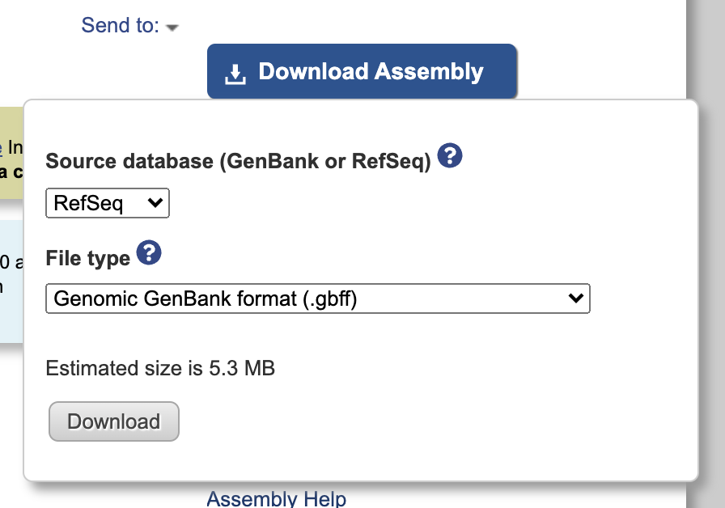

<br>

We will do a practice run using the Burkholderia cenocepacia HI2424 entry on Genbank. This strain contains multiple chromosomes so must first merge the chromosome into one data file. If your organism only contains one chromosome, then go directly to the [Extracting old locus tags (on your local computer)](#extracting-old-locus-tags) section.

***

# Downloading Genbank file


Go to [NCBI assembly GCF_000203955.1](https://www.ncbi.nlm.nih.gov/assembly/GCF_000203955.1) and download gbff file. 

Click the Download Assemble button and select RefSeq and .gbff from the dropdown menu:

{: .image-resize .image-center}

Once downloaded, make sure that the old locus tags are present by unzipping and opening the file in a text editor. To check, use Cmd+F to look for "/old_locus_tag".

Once you confirm that the old locus tags are present, we will combine the chromosomes so they are in one piece. This will make it easier to cross reference between the breseq files and the new-to-old locus translation table we will make.

***

# Merge multiple chromosomes into one file

First, lets use python to read our .gbff file and merge the chromosomes into one (remember to change the filepath to your own filepath):

```python
from Bio import SeqIO
merged_rec = ''
infile = "/Users/kubotan/Downloads/GCF_000203955.1_ASM20395v1_genomic.gbff"

for rec in SeqIO.parse(open(infile,"r"), "genbank") :
    merged_rec += rec
merged_rec.id = "mergedseq"
merged_rec.description = "merged seq"
SeqIO.write(merged_rec, "/Users/kubotan/Downloads/merged_old_locus.gbk", "genbank")
```

***

# Extracting old locus tags

## On your local computer

Now we will extract the locus_tag, old_locus_tag, gene, start, and end data. Then we will save it in a DataFrame before writing it as a .csv:
```python
import pandas as pd
import re

old_rec = SeqIO.read("/Users/kubotan/Downloads/merged_old_locus.gbk", "genbank")
record = []

for feature in old_rec.features:
    record.append(
        {
            'locus_tag': re.sub(r"[\['\]']", "", str(feature.qualifiers.get('locus_tag'))),
            'old_locus_tag': re.sub(r"[\['\]']", "", str(feature.qualifiers.get('old_locus_tag'))),
            'gene':  re.sub(r"[\['\]']", "", str(feature.qualifiers.get('gene'))),
            'start': feature.location.start,
            'end': feature.location.end
        }
    )

df = pd.DataFrame(record)
df.to_csv("locus_translations.csv")
```

You can now open the .csv file in Excel and you should be able to see the locus tag and corresponding old locus tag, as well as where they are located in the merged single chromosome.

## On beagle

To run this on the beagle server, you can combine the above code in a text editor and save it as a .py file (i.e. a python script file). Make sure to upload the .gbff file to Beagle and change the file paths in the script so that the computer knows to look into your own directory and not mine.

Then save the following script as a .py file (ex. extract_old_locus.py). I've commented in the script where you need to change the file path:
```bash
#! /usr/bin/python

from Bio import SeqIO
import pandas as pd
import re

merged_rec = ''
infile = "/home/nak177/ref_seq/GCF_000203955.1_ASM20395v1_genomic.gbff" #change this to your Beagle directory
for rec in SeqIO.parse(open(infile,"r"), "genbank") :
    merged_rec += rec + ("N" * 50)
merged_rec.id = "mergedseq"
merged_rec.description = "merged seq"
SeqIO.write(merged_rec, "/home/nak177/ref_seq/merged_old_locus.gbk", "genbank") #change this to your Beagle directory
old_rec = SeqIO.read("/home/nak177/ref_seq/merged_old_locus.gbk", "genbank") #change this to your Beagle directory

record = []
for feature in old_rec.features:
    record.append(
        {
            'locus_tag': re.sub(r"[\['\]']", "", str(feature.qualifiers.get('locus_tag'))),
            'old_locus_tag': re.sub(r"[\['\]']", "", str(feature.qualifiers.get('old_locus_tag'))),
            'gene':  re.sub(r"[\['\]']", "", str(feature.qualifiers.get('gene'))),
            'start': feature.location.start,
            'end': feature.location.end
        }
    )

df = pd.DataFrame(record)
df.to_csv("/home/nak177/burk_pa/locus_translations.csv") #change this to your Beagle directory; this is your output directory
```

Upload the python script onto Beagle:
```bash
scp -r /Users/kubotan/Downloads/extract_old_locus.py nak177@beagle.mmg.pitt.edu://home/nak177/burk_pa/
```


Lets first load miniconda so that you can run the python script:
```bash
module load miniconda
```

Then you can run the script using:
```bash
python /home/nak177/burk_pa/extract_old_locus.py
```
You should see a .csv file wherever you indicated in your file path within the python script.

Now lets download this back onto your computer:
```bash
scp -r nak177@beagle.mmg.pitt.edu://home/nak177/burk_pa/locus_translations.csv /Users/kubotan/Downloads
```